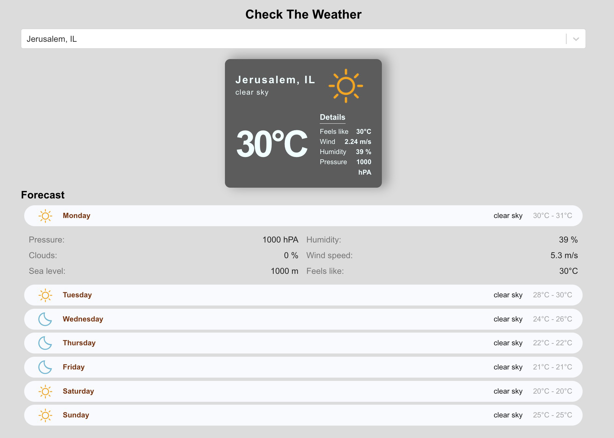

# React Weather App

This project was bootstrapped with [Create React App](https://github.com/facebook/create-react-app).

## Application 
[Demo of application](https://react-weather-app-ba8e6.web.app/)

## Used APIs
- [GeoDB Cities](http://localhost:3000)
- [Open Weather](http://localhost:3000)

## User Libraries
- [react](http://localhost:3000)
- [react-accessible-accordion](http://localhost:3000)
- [react-select-async-paginate](http://localhost:3000)
- [tailwind css](https://tailwindcss.com/docs/guides/create-react-app)
- [firebase](https://console.firebase.google.com/)

## Quick Description

This application contains a search component with auto-complete. 

You can find a desired city and the application will present a current weather state.

Also, it presents a forecast for the next 7 days with additional information that can be expanded by clicking on one of the days.

## Contact Details
[Linkedin](https://www.linkedin.com/in/alexander-komanov-88b138158/)

[Facebook](https://www.facebook.com/akomanov/)

Feel free to use!